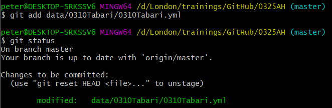
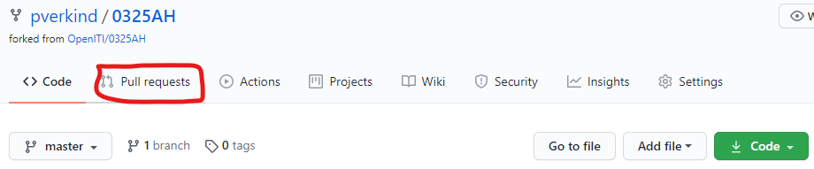

# OpenITI documentation

[](./media/image37.png)

NB: this documentation is a work in progress. Please feel free to
contact us if you feel something is missing or unclear.

[1. What is OpenITI?](#1-what-is-openiti)

* [A brief history of the OpenITI corpus](#a-brief-history-of-the-openiti-corpus)
* [Goals](#goals)
* [Working version (GitHub repositories) vs. Corpus Releases (Zenodo)](#working-version-github-repositories-vs.-corpus-releases-zenodo)
* [The GitHub Repositories](#the-github-repositories)
* [Zenodo releases](#zenodo-releases)
* [What texts are in OpenITI?](#what-texts-are-in-openiti)
* [Further reading](#further-reading)

[2. Structure and organization of the OpenITI
GitHub](#2-structure-and-organization-of-the-openiti-github)

* [Text repositories](#text-repositories)
* [25-years folders](#years-folders)
* [URIs & CTS-Like Folder Structure](#uris-cts-like-folder-structure)
* [Text files: mARkdown](#text-files-markdown)
* [Metadata: YAML files](#metadata-yaml-files)
* [YML-1 (Version Record)](#yml-1-version-record)
* [YML-2 (Book Record)](#yml-2-book-record)
* [YML-3 (Author Record)](#yml-3-author-record)
* [RAW folders](#raw-folders)
* [Working repositories](#working-repositories)
* [Annotation repo](#annotation-repo)
* [Instantiations](#instantiations)

[3. Working with GitHub](#3-working-with-github)

* [Why use a version control system?](#why-use-a-version-control-system)
* [Getting started with GitHub](#getting-started-with-github)
* [Create a GitHub account](#create-a-github-account)
* [Installing Git](#installing-git)
* [On Windows](#on-windows)
* [On Mac](#on-mac)
* [On Linux](#on-linux)
* [Introducing your main git tool: Git Bash](#introducing-your-main-git-tool-git-bash)
* [On Mac](#on-mac-1)
* [On Linux](#on-linux-1)
* [Working with OpenITI text repositories](#working-with-openiti-text-repositories)
* [Create your personal copy of an OpenITI repo: Forking](#create-your-personal-copy-of-an-openiti-repo-forking)
* [Create a copy of your OpenITI fork on your computer: Cloning](#create-a-copy-of-your-openiti-fork-on-your-computer-cloning)
* [Keep up to date with OpenITI: pull changes](#keep-up-to-date-with-openiti-pull-changes)
* [Set up a direct connection between your local repo and the one on OpenITI's GitHub page](#set-up-a-direct-connection-between-your-local-repo-and-the-one-on-openitis-github-page)
* [Synchronize your local repository with the "upstream" repo](#synchronize-your-local-repository-with-the-upstream-repo)
* [Save your changes: add and commit](#save-your-changes-add-and-commit)
* [Contribute to OpenITI: push changes and pull requests](#contribute-to-openiti-push-changes-and-pull-requests)
* [Summary](#summary)
* [Raising GitHub issues](#raising-github-issues)
* [Contributing New Texts](#contributing-new-texts)
* [The easy way: contact us](#the-easy-way-contact-us)
* [The barzakh repository](#the-barzakh-repository)
* [Further reading on GitHub](#further-reading-on-github)

[4. Annotation guidelines](#4-annotation-guidelines)

* [Annotation workflow](#annotation-workflow)
* [Validation workflow](#validation-workflow)
* [OpenITI mARkdown](#openiti-markdown)
* [Further reading](#further-reading-1)

[5. Software (versions and
installation)](#5-software-versions-and-installation)

* [EditPad Pro](#editpad-pro)
* [Git Bash](#git-bash)

[6. Teaching and learning
resources](#6-teaching-and-learning-resources)

[7. FAQ](#faq)

* [How can I find a text in OpenITI?](#how-can-i-find-a-text-in-openiti)
* [The text I\'m looking for is not in OpenITI. What now?](#the-text-im-looking-for-is-not-in-openiti.-what-now)
* [How do I add a text to the OpenITI corpus?](#how-do-i-add-a-text-to-the-openiti-corpus)
* [How do I request a new text be added?](#how-do-i-request-a-new-text-be-added)
* [How do I cite OpenITI texts?](#how-do-i-cite-openiti-texts)
* [Do you use texts generated by Optical Character Recognition?](#do-you-use-texts-generated-by-optical-character-recognition)
* [How can I help develop OpenITI?](#how-can-i-help-develop-openiti)
* [I found a typo in a text / a mistake in the metadata or URI. How do I flag this?](#i-found-a-typo-in-a-text-a-mistake-in-the-metadata-or-uri.-how-do-i-flag-this)
* [How can I use OpenITI? What license is used?](#how-can-i-use-openiti-what-license-is-used)
* [what about copyright issues?](#what-about-copyright-issues)
* [Why do you use mARkdown rather than TEI? Can I convert my TEI tags to mARkdown or vice versa?](#why-do-you-use-markdown-rather-than-tei-can-i-convert-my-tei-tags-to-markdown-or-vice-versa)
* [A text I am researching is in the corpus but not annotated, or the annotation is insufficient for my research interests. What do I do?](#a-text-i-am-researching-is-in-the-corpus-but-not-annotated-or-the-annotation-is-insufficient-for-my-research-interests.-what-do-i-do)
* [I am not sure there is an appropriate mARkdown annotation, or I am not sure how to annotate a particular part of a text. What do I do?](#i-am-not-sure-there-is-an-appropriate-markdown-annotation-or-i-am-not-sure-how-to-annotate-a-particular-part-of-a-text.-what-do-i-do)

[Glossary](#glossary)

## 1. What is OpenITI?


OpenITI is a corpus of digital Islamicate texts. It is mainly meant as
the foundation that can be used for new forms of macro textual analysis
and digital scholarship. It is (currently) not a digital library with a
user interface, reading environment and search functions.

### A brief history of the OpenITI corpus 


OpenITI was founded in 2016 by Maxim Romanov, Sarah Savant and Matt
Miller, who each had been working on individual corpus projects, because
of their dissatisfaction with existing repositories of digital Arabic
and Persian texts. They
[described](https://doi.org/10.1017/S0020743817000964) the
problem with these text collections as threefold: "they are not
compliant with any international data standards; they typically lack
scholarly metadata; and they do not adequately represent the diversity
of the historic traditions."

The principles on which the new corpus should rest have been described
in a research paper published in
[2018](https://doi.org/10.1017/S0020743817000964): the
corpus should be developed as a collective effort by the field, "address
the research needs of scholars and meet academic standards in terms of
the quality of their texts and metadata", and promote open research by
offering clear metadata on the provenance of digitized texts, providing
a sustainable way of citing these digital texts, and ensuring the data
conforms to international data standards and frameworks, guaranteeing
the usability of the corpus for the widest range of digital research.
The corpus can be used free of charge, but users pledge to help develop
the corpus by flagging problems with the texts, providing new texts for
the corpus, etc.

The first iteration of the corpus, OpenArabic, was developed by Maxim
Romanov, first at Tufts University (at The Perseus Project, 2013--2015)
and then at Leipzig University (at the Alexander von Humboldt Chair for
Digital Humanities, 2015--2017), in both cases with the support and
under the patronage of Prof. Gregory Crane. The Persian branch of the
project has its origin in the Persian Digital Library, developed by Matt
Miller at the Roshan Institute for Persian Studies, University of
Maryland.

### Goals


The OpenITI's main
[aim](https://alraqmiyyat.github.io/OpenITI/) is to
provide the "textual infrastructure (...) for new forms of macro textual
analysis and digital scholarship" for Islamicate texts, that is, texts
written by Muslims and/or in contexts in which Muslims were socially and
culturally dominant. This includes texts written by Muslims and
non-Muslims, on any imaginable topic, in a variety of languages,
including of course Arabic, New-Persian and Turkish (used by Muslims and
non-Muslims alike), but also Syriac, Hebrew and Middle-Persian (used
primarily or even exclusively by non-Muslims). The infrastructure will
be described below; it includes a corpus of Islamicate texts (in plain
text format with minimal markup to facilitate the widest possible range
of computational analysis), and associated metadata on the texts, their
authors and digitizations.

The corpus is organised on GitHub, based on established practices in the
Digital Humanities and organised based on the approach used by Canonical
Text Services (CTS) - as used, for example, in the Perseus Digital
Library. The corpus is organised to be machine-actionable. A uniform
organisation and tagging scheme within texts ensures that the files can
be easily identified and accessed using various scripts, allowing us to
apply digital methods at the corpus level, or select a particular part
of the corpus for analysis (potentially based on metadata). Annotation
further allows for files to be analysed or compared at the structural
level (at the level of specific chapters, sections of paragraphs) The
structure of the corpus might look unfamiliar to those used to accessing
texts through libraries, but it is essential for performing digital
tasks at scale.

The OpenITI corpus is evolving. Texts are constantly being added and
annotated and metadata is being revised. For the OpenITI to function, it
must be maintained and updated in a uniform manner. The policies for
corpus management and annotation set out in the OpenITI documentation
ensure that the corpus remains uniform, up-to-date and useful for future
digital analysis.

### Working version (GitHub repositories) vs. Corpus Releases (Zenodo) 


Users of the OpenITI corpus will find the corpus in two key locations:
GitHub
([https://github.com/openiti](https://github.com/openiti))
and [Zenodo](https://doi.org/10.5281/zenodo.3082463) (links for specific releases given below). The first is the active
version of the corpus, and the second keeps snapshots of the corpus at
a given time, for citation purposes.

### The GitHub Repositories

GitHub is where contributors to the OpenITI corpus do most of their
work. It allows for version control, which ensures nothing is lost (see
further, the sections on GitHub). Texts can be downloaded from the
GitHub repository, annotated and then put back. It is the place where
new texts are first added, annotations are updated and verified and
where automated experiments on the corpus are first undertaken. Work in
GitHub can be experimental and iterative, because version control (plus
the use of forking) helps protect against mistakes.

Further reading:

* [Structure and organization of the OpenITI
GitHub](#2-structure-and-organization-of-the-openiti-github)
* [Working with GitHub](#3-working-with-github)

### Zenodo releases

High quality research must be citable and verifiable. If we are to
publish the results of an experiment, another reader must be able to
check the results if they so wish. In this case, citing the OpenITI
GitHub is inappropriate, because it is subject to constant change. A
text cited from the OpenITI might not be the same in two years\' time
(it might have been further annotated, or some errors might have been
corrected).

For this reason we release the corpus regularly onto Zenodo. This is a
platform that allows for the archiving of data that can be linked
throughout time without any risk of change. The corpus is released onto
Zenodo with a specific version number (based on the date of the
release). A full record of the releases is found
[here](https://zenodo.org/record/4075046#.X9Cj72j7RPY).
See also the list of releases below:

| Link | How to cite? |
|------|--------------|
| [Zenodo release 2019.1.1](https://zenodo.org/record/3082464#.X9CjwGj7RPY) | Maxim Romanov, Masoumeh Seydi, 2019: OpenITI: A Machine-Readable Corpus of Islamicate Texts. Version 2019.1.1. [https://zenodo.org/record/3082464\#.X9CjwGj7RPY](https://zenodo.org/record/3082464#.X9CjwGj7RPY) |
| [Zenodo release 2020.1.2](https://zenodo.org/record/3891466#.X9CjZGj7RPY) | Lorenz Nigst; Maxim Romanov; Sarah Bowen Savant; Masoumeh Seydi; Peter Verkinderen, 2020: OpenITI: A Machine-Readable Corpus of Islamicate Texts. Version 2020.1.2. [https://zenodo.org/record/3891466\#.X9CjZGj7RPY](https://zenodo.org/record/3891466#.X9CjZGj7RPY) |
| [Zenodo release 2020.2.3](https://zenodo.org/record/4075046#.X9Cf_mj7RPY) | Lorenz Nigst; Maxim Romanov; Sarah Bowen Savant; Masoumeh Seydi; Peter Verkinderen, 2020: OpenITI: A Machine-Readable Corpus of Islamicate Texts. Version 2020.2.3. [https://zenodo.org/record/4075046\#.X9I1jNj0lPZ](https://zenodo.org/record/4075046#.X9I1jNj0lPZ) |
| [Zenodo release 2021.1.4](https://zenodo.org/record/4513723#.YDYKUmj0ncs) | Lorenz Nigst; Maxim Romanov; Sarah Bowen Savant; Masoumeh Seydi; Peter Verkinderen, 2020: OpenITI: A Machine-Readable Corpus of Islamicate Texts. Version 2021.1.4. [https://zenodo.org/record/4513723\#.YDYKUmj0ncs](https://zenodo.org/record/4513723#.YDYKUmj0ncs) |

When publishing research, it is important to refer to the exact release
number that was used for the research project. For example, if one
downloaded the 2019.1.1 version of the corpus from Zenodo and did text
mining using that corpus, one should cite 2019.1.1 in the paper. This
allows other readers to repeat results. It also allows us to associate
analysis of the full corpus with a release number (for example passim
runs are always associated with a particular Zenodo release).

The DOI [10.5281/zenodo.3082463](https://doi.org/10.5281/zenodo.3082463)
will always refer to the latest release of OpenITI.

### What texts are in OpenITI?


The latest release of OpenITI contains 10,202 text files, each of which
contains the full text of a work (whether it is a single-volume or
multi-volume work). For some works, the corpus contains multiple
versions (digitizations of distinct paper editions, distinct
digitizations of the same edition, identical digitizations of the same
edition). The 10,202 text files represent 6,236 distinct works, by 2,582
distinct authors.

In its current state, the OpenITI corpus consists almost exclusively of
Arabic texts, with a strong focus on the pre-modern period:


*Text files in OpenITI, per hijrī century (light blue: number of text
files; dark blue: number of distinct books; red: number of distinct
authors). NB: pre-Islamic texts are in the first-century column, texts
by authors still alive in the 15th-C column. (data: Dec. 2020)*

These text files together represent 2 billion words. Huge numbers like
these are hard to visualize; 1.8 billion words amount to almost 7
million pages if every page would contain 300 words, and almost 23.000
volumes if every volume would contain 300 pages; one would need about
150 of Ikea's Billy bookcases to fit these in.

The length of the works in the corpus varies (see Figure 6); the
shortest works are only a couple of lines long (a single poem, a few
aḥādīth), while the largest book in the corpus, Biḥār al-Anwār,
Majlisī's encyclopaedic collection of Imamite ḥadīth, amounts to almost
12 million words. The latter work falls out of the range of our current
study, since its author died in 1111 AH; the largest work in the corpus
before 1000AH is Ibn ʿAsākir's Tārīkh Madīnat Dimashq, with slightly
under 10 million words. Both Majlisī's work and Ibn ʿAsākir's are
outliers; no other single work in the corpus contains more than 6
million words, but the corpus does contain more than 450 text files with
more than 1 million words (203 distinct works, by 168 distinct authors).
Most other works cluster in the range between 10.000 and 200.000 words.

There is a noticeable evolution over the first 9 hijrī centuries of
books growing bigger with time. Whereas the median length of books from
the second Islamic century in the corpus is 17,830 words (which is about
1/8 of the word count of the Qur'ān, or about the same size as the Bible
book Job), by the ninth century, it is about 5 times higher at 79,286.


*Length of the books in OpenITI, per hijrī century (attention:
logarithmic scale!). The upper light blue horizontal line represents the
longest book, the bottom one the shortest book; the number of words of
the longest and shortest book are given (K=1,000, M=1,000,000). The blue
box represents the middle two quartiles (separated by the median line,
in black): half of the books in this century have a length that fits in
this box. The black dot represents the average length of books in that
century.* (data: Dec. 2020)

The texts in OpenITI come from a variety of sources. The overwhelming
majority of texts (8431 texts) were scraped from 12 digital text
collections; a small but growing number were digitized by the KITAB team
by manual transcription or using OCR (26 texts) or provided by users of
OpenITI (19 texts):

| COUNT | COLL. ID | FULL NAME | LINK | SHORT DESCRIPTION |
|-------|----------|-----------|------|-------------------|
| 3635 | Shamela | al-Maktaba al-Shāmila | [shamela.ws](http://www.shamela.ws/) | Large digital open-access library, scraped ca. 2014 (*official version*) |
| 125 | Sham19Y | al-Maktaba al-Shāmila (2019 additions) | [shamela.ws](http://www.shamela.ws/) | Additional scrape of new texts in October 2019 (*official version*) |
| 2308 | JK | al-Jāmiʿ al-kabīr | Books digitized by Jordanian publisher Markaz al-Turāth |
| 1041 | Shia | al-Maktaba al-Shīʿiyya | [shiaonlinelibrary.com](http://shiaonlinelibrary.com/) | Text collection by the Ayatollah Milani Foundation |
| 530 | ShamAY | (gift) | Official version of al-Maktaba al-Shāmila + private collection of digitized books |
| 394 | Zaydiyya | al-Maktaba al-Shāmila al-Zaydiyya | Collection of Zaydī texts, packaged in a Maktaba Shamela instance |
| 132 | ShamIbadiyya | al-Maktaba al-Shāmila al-Ibāḍiyya | [archive.org/details/5\_20190723](https://archive.org/details/5_20190723) | Collection of Ibāḍī texts by the Algerian Jamʿiyyat al-Turāth, packaged in a Maktaba Shamela instance |
| 99 | GRAR | Graeco-Arabic Studies Corpus | [graeco-arabic-studies.org](https://graeco-arabic-studies.org/) | A Digital Corpus for Graeco-Arabic Studies |
| 81 | Tafsir | al-Tafāsīr | [altafsir.com](http://www.altafsir.com/) | Collection of Qur\'ān commentaries by the Jordanian "Royal Aal al-Bayt Institute for Islamic Thought" |
| 77 | Sham30K | al-Maktaba al-Shāmila (30.000 texts) | [archive.org/details/SHAMELH30-1-20](https://archive.org/details/SHAMELH30-1-20) | Official version of al-Maktaba al-Shamela + large amount of additional texts |
| 4 | Filaha | The Filāḥa Project | [filaha.org/](http://www.filaha.org/) | Arabic books on husbandry |
| 1 | Hindawi | Hindawi | [hindawi.org/books/](https://www.hindawi.org/books/) | Books published by the Hindawi Foundation |
| 1 | BibleCorpus | Bible Corpus | [github.com/christos-c/bible-corpus](https://github.com/christos-c/bible-corpus) | A multilingual parallel corpus of Bible translations |

4290 out of the 5104 distinct works in OpenITI derive from three main
source collections (Sham, JK and ShiaOL). These three collections
overlap to a significant extent. While only a small number of books,
less than 10 percent of the 4290, are represented in all three
collections, almost half of the books are represented in more than one
collection.


*Overlap of the main source collections of OpenITI: al-Maktaba
al-Shāmila (Sham), al-Jāmiʿ al-Kabīr (JK), ShiaOnlineLibrary (ShiaOL).*

**TO DO: genre breakdown**

### Further reading


-   [The first-ish general description of OpenITI](https://maximromanov.github.io/OpenITI/)

## 2. Structure and organization of the OpenITI GitHub

The OpenITI GitHub page contains a large number of repositories, which
can be divided into several groups:

-   Text files, along with metadata on each author, book and version;
     these are organized in repositories that each cover a
     chronological period of 25AH lunar years. The names of the text
     repositories look like this: 0025AH, 0050AH (the number being the
     last year in the period for which it contains the texts)

-   Working repositories: these contain data for the maintenance and
     development of OpenITI. The most important working repository is
     the Annotation repo.

-   Instantiation repositories: these repositories contain special
     versions of the corpus, prepared for specific applications (e.g.,
     istylo, an instantiation of the corpus for use with the R library
     stylo). These repos all start with a prefix "i".

### Text repositories

#### 25-years folders

The entire corpus is divided into a series of repositories. Each
repository covers a chronological period of 25AH lunar years: 
1) the main folder within each repository is `data`, which contains subfolders
    for each author who died within a given period; 
2) each author's subfolder includes subfolders for this author's books (often in multiple
    versions). For example, the repository 0525AH includes authors whose
    death dates fall in the range of 501--525 AH). 

Below is an example of how al-Ġazālī's Iḥyāʾ ʿulūm al-dīn fits into the corpus.


From this example, you can see that the repository `0525AH` includes a
subfolder `data`, which includes a subfolder with al-Ġazālī's URI,
`0505Ghazali`, which then includes a subfolder with Iḥyāʾ ʿulūm al-dīn's URI
(uniform resource identifier), `0505Ghazali.IhyaCulumDin`, which then
includes all the relevant files. 

NB: README.md files contain some
technical descriptions; \*.yml files contain
machine-readable metadata (On these metadata files see the description
of YAML files below).

#### URIs & CTS-Like Folder Structure

OpenITI URIs are CTS-compliant and constructed hierarchically, by
chaining together sub-URIs. To make this example more understandable in
the context of OpenITI, let's take a look at a practical example of
al-Ḏahabī's Taʾrīḫ al-islām below.


1.  Namespaces are standard technical parameters from the CTS URN
     structure which, among other things, allow building and
     maintaining multilingual corpora.

2.  AuthorID is the unique identifier for an author. As a rule, AuthorID
     is formed by combining (a) the hijrī year of death formatted into
     a 4-digit number (prepended with 0s, if necessary) and (b) the
     šuhraŧ of the author, since this is usually the most recognizable
     element of any author's name. The year of death in the AuthorID
     does not have to be exact, if any controversy exists. Even an
     approximate date will suffice, since it will allow you to arrange
     texts chronologically. Any issues regarding the year death can
     described in the metadata files (\*.yml). In the above example,
     `0748Dhahabi` is the identifier for Šams al-dīn al-Ḏahabī, who died
     in 748/1347

3.  BookID is an element that identifies a book (book title), usually
     formed from one or two recognizable keywords from the title.
     Combined with the preceding elements, it becomes 7: Unique Work
     Identifier.

4.  VersionID points to the origins of the specific version of a text
     and allows accommodating multiple versions of the same text. It is
     formed by combining the name of a digital library or collection
     from which the text originates with the unique number of this text
     in that collection. In cases when texts are provided by
     individuals or projects, the last name of the provider or the name
     of the project is used as name, while texts are numbers
     sequentially within the provided batch. Combined with the
     preceding elements it becomes 8: Unique Edition Identifier.

5.  Lang indicates the main language of the text (these are ISO 639-2
     codes, see [Codes for the Representation of Names of
     Languages](https://www.loc.gov/standards/iso639-2/php/code_list.php)
     at the LOC website). Lang also allows one to accommodate
     translations of a specific version of a text. For example, the URI
     `0748Dhahabi.TarikhIslam.Shamela0035100-eng1` would indicate an
     English translation of al-Ḏahabī's Taʾrīḫ al-islām, which is based
     on the text represented with the URI in the
     example---`0748Dhahabi.TarikhIslam.Shamela0035100-ara1`; the number
     that follows the three-letter language code also allows to
     accommodate additional versioning. For example, the URI
     `0748Dhahabi.TarikhIslam.Shamela0035100-eng2` would represent
     another translation of
     `0748Dhahabi.TarikhIslam.Shamela0035100-ara1`. Combined with the
     preceding elements, it becomes 9: Unique Version Identifier.

6.  Passage is the ID of a specific text unit (like a chapter, a
     biography, a paragraph, etc.). Combined with the preceding
     elements, it becomes 10: Unique Passage Identifier. For more information on the naming conventions of the special cases, such as large texts that spread across multiple files, please see the document [here](https://docs.google.com/document/d/1d7qlanLOLmcBFZLeH_rE8r5i3BqATeeGyeLTvkupn70/edit?usp=sharing) (in progress). New cases will be added to this document.

#### Text files: OpenITI mARkdown

-   [Current description of OpenITI
     mARkdown](https://maximromanov.github.io/mARkdown/) @
     maximromanov.github.io

-   [Updating
     mARkdown](https://docs.google.com/document/d/1N2mcXVCU1fPk4BbH3jSL10D83_98y87hxy1juQwVock/edit?usp=sharing),
     working document by Maxim and Peter.

    -   Also, from previous discussions of [logical
         chunking](https://docs.google.com/document/d/1etXDRSUjVJJRuIWlh80g343V_wQ_6OWaZ4VzYv0RbRM/edit)
         with Masoumeh.

    -   Main goal: simplification of mARkdown, i.e. removing and
         shortening whatever can be removed and shortened.

        -   Each unit of text must receive a unique ID:

            -   Automatically: a random number of 12 digits

            -   Manually: a timestamp (YYMMDDHHMMSS); see, here:
                * [https://maximromanov.github.io/sakhawi\_project/](https://maximromanov.github.io/sakhawi_project/)

            -   IDs to be stored in

-   [mARkdownMSS](https://docs.google.com/document/d/1MTBiCTc0URbtDbDrrWUGGKqdpGh5hvj0t738R0CXepU/edit?usp=sharing),
     a working version \-\-- Maxim together with Matt Miller, for Carl
     Ernst (UNC, Chapel Hill) and Mbaye Lo (Duke U); input is needed
     from Peter, Lorenz, and others)

-   Extra:

    -   Basic vs. advanced annotation - with use cases? (examples are
         given in the general description of mARkdown)

    -   [DSP Dataset
         Preparation](https://docs.google.com/document/d/19EZE_2jK44IgqK2dbq9-uywuvbAW-jG-Gyd9Cf-pLYg/edit?usp=sharing)
         section 6 has a use case for semantic tagging

### Metadata: YAML files

OpenITI contains metadata for each author, work and text version. 
This metadata is stored in separate metadata files in YAML format (\*.yml).
There are three types. For their locations see [above](#25-years-folders)


#### YML-1 (Version Record)

YML-1 Version YAML files relates to a specific version of a text,
and are stored together with the text version they describe. 
For example, there are
multiple versions of Ibn al-Jawzi's Muntazam in the corpus, based on
different editions and sourced from different digitisation projects.
Each of these texts has a YML-1 file.

For example if the text file is
**0597IbnJawzi.Muntazam.Shamela0012406-ara1.mARkdown**, the
corresponding YML file will be
**0597IbnJawzi.Muntazam.Shamela0012406-ara1.yml**

YML-1 files record the name of the annotator, the date of annotation and
any issues encountered with the text. They also document the printed
edition, upon which the text is based (80\#VERS\#BASED\#\#\#\#) and the
version that the annotator used to annotate the text
(80\#VERS\#COLLATED\#), usually the same version .

**The following is an explanation of YML-1 fields:**


| Field | Description | Example (from [this](https://github.com/OpenITI/0600AH/blob/master/data/0597IbnJawzi/0597IbnJawzi.Muntazam/0597IbnJawzi.Muntazam.Shamela0012406-ara1.yml) file) |
|-------|-------------|---------------------|
| 00\#VERS\#CLENGTH\#\#: | in characters (autoupdated) | **5785781** |
| 00\#VERS\#LENGTH\#\#\#: | in words (autoupdated) | **1414455** |
| 00\#VERS\#URI\#\#\#\#\#\#: | XXXShuhra.Title.Version (autoupdated) | **0597IbnJawzi.Muntazam.Shamela0012406-ara1** |
| 80\#VERS\#BASED\#\#\#\#: | permalink (e.g. from worldcat) of the edition that the text is based on. | **http://www.worldcat.org/oclc/1035773549** |
| 80\#VERS\#COLLATED\#: | permalink (e.g. from worldcat) of the edition that the text that the annotator used to annotate the text - usually the same as the link above. | **http://www.worldcat.org/oclc/1035773549** |
| 80\#VERS\#LINKS\#\#\#\#: | Link to a location where a digital copy of the original edition (e.g. a pdf) might be found. If not using a printed version, add a permalink to the worldcat page for the book that was used. | **https://archive.org/details/muntazim\_tarikh\_mlouk\_oumm** |
| 90\#VERS\#ANNOTATOR: | Name of the people who annotated the text | **Maroussia** |
| 90\#VERS\#COMMENT\#\# | A free-running comment on the text | Comment inserted in metadata was removed\... third level header would be meaningful to provide the text with a better structure. |
| 90\#VERS\#DATE\#\#\#\#\#: | YYYY-MM-DD (the date of annotation) | **2019-07-24** |
| 90\#VERS\#ISSUES\#\#\#: | formalised issues, separated with commas | **HEADERS, BIOGRAPHICAL-TAGS** |

**Further guidance on filling out YML-1 files**

When filling out version yaml files, it is essential to use permalinks in the
fields `80#VERS#BASED####` and `80#VERS#COLLATED#`, for example
from Worldcat. To get a permalink, follow these steps:

1.  Go to [https://www.worldcat.org](https://www.worldcat.org/)

2.  Search for a needed book; there are usually many records --- pick
     the one that looks best (those submitted by major libraries are
     usually quite good)

3.  Open that record and copy a permalink from a small pop-up window as
     shown on the screenshot below.


For `90#VERS#ISSUES###:` there is a formalised list of issues that
can be used here:

| Tag | Description of an issue |
|-----|-------------------------|
| **NO\_MAJOR\_ISSUES** | *No major issues* |
| **PAGINATION** | *When pagination was not successfully implemented.* |
| **FOOTNOTES** | *When there are footnotes still in the text* |
| **HTML\_TAGS** | *When there are HTML tags in the text* |
| **RANDOM\_CHARS** | *Random symbols in the text (something that should be cleaned)* |
| **NEW\_EDITION\_NEEDED** | *The electronic text and the edition itself are of poor quality; a new version, probably based on a different edition, is needed; a candidate for the OCR platform.* |
| **ASSESSMENT\_NEEDED** | *The text is problematic in a variety of ways; perhaps, not a real text at all, but a product of editor's imagination; requires an expert's assessment; a candidate for removal from the corpus * |
| MISSING\_PARTS | *There are lines/paragraphs/verses/words in the PDF that don't appear in the Editpro version.* |
| REDUNDANT\_PARTS | *There are lines/paragraphs/verses/words in the Editpro version that don't appear in the PDF (this is a bit strange but happens even when the PDF edition is exactly the same as the Editpro edition; so it has nothing to do with selecting a different edition).* |
| MANY\_TYPOS | *A lot of typos in the Editpad Pro version.* |
| REVIEW\_NEEDED | *The annotator is not entirely sure about the tagging and the tagging need to be reviewed by a specialist in the field of the book (the annotator must explain the reason in the yml file and use this tag only when the whole book need to be reviewed and the problem cannot be explained by asking a simple question in the meetings. ATTENTION: use this tag as less as possible!). * |
| EDITORIAL\_SECTIONS | *Anything added by modern editor(s) (the introduction of the editor(s), explanations about the manuscript or the author, indexes at the end of the book, ...). These parts will be removed. * |
| INCOMPLETE\_VERSION | *The version contains only a part of the work (e.g., only one volume of a multi-volume edition; a manuscript transcription that does not cover all of the text). Indicate which parts of the text are present. Ideally, in the future, this will be done with CTN-style section references; for now, a description will be needed.* |
| RECONSTRUCTED\_TEXT | *The text is the result of a reconstruction by a modern editor, usually from quotations of a lost text in a large number of other works. * |

#### YML-2 (Book Record)

Each distinct work in the corpus has a YML-2 file. For example, the
YML-2 for al-Tabari's Tahdhīb al-Āthār, would be:
`310Tabari.TahdhibAthar.yml` (note that the file does not include the
version part of the URI, as this file is relevant to all versions of the
book). This file provides further in-depth metadata about the book
itself.

**The following is an explanation of the fields in a YML-2 file.**

For an original file see: [0310Tabari.TahdhibAthar.yml](https://github.com/OpenITI/0325AH/blob/master/data/0310Tabari/0310Tabari.TahdhibAthar/0310Tabari.TahdhibAthar.yml)

| Field | Description | Example (random, not necessarily real |
|-------|-------------|---------------------------------------|
| **00\#BOOK\#URI\#\#\#\#\#\#:** | The URI of the book : XXXShuhra.IsmKitab (autoupdated) | 0310Tabari.TahdhibAthar |
| **10\#BOOK\#GENRES\#\#\#:** | Classification of books into forms and genres according to different sources, comma-separated. Template: `src@keyword` : `src` indicates the creator of the category and `keyword` indicates classification. So the example means that Brockelman's *Geschicte der arabischen Litteratur* (GAL) categorises the text as hadith. | GAL@hadith |
| **10\#BOOK\#TITLEA\#AR:** | Short title of the work, written in betacode. | Tahḏīb al-Āṯār |
| **10\#BOOK\#TITLEB\#AR:** | Full title of the work, written in betacode | Tahḏīb al-āṯār wa-tafṣīl al-ṯābit ʿan rasūl Allāh min al-aḫbār |
| **20\#BOOK\#WROTE\#\#\#\#:** | Locations where the work was written, using URIs from Althurayya ([[https://althurayya .github.io/]{.underli ne}](https://althuray ya.github.io/)), comma separated. The example is the URI for Baghdad. For an explanation on getting URIs from Althurayya, see below | BAGHDAD\_443E333N\_S |
| **30\#BOOK\#WROTE\#\#AH:** | Year that the book was written (or X+ for unknown), with AH date. Format: YEAR-MON-DA | 0305-XXX-XX |
| **40\#BOOK\#ABRIDGED\#:** | If this work is an abridgement of an earlier work, enter the book URI here. Enter the author's title if the book is not present in the OpenITI. THIS WILL BE SUBJECT TO CHANGE IN A FUTURE UPDATE TO YML FILES | |
| **40\#BOOK\#COMMENTD\#:** | If this work is a commentary on an earlier work, enter the book URI here. Enter the author's title if the book is not present in the OpenITI. THIS WILL BE SUBJECT TO CHANGE IN A FUTURE UPDATE TO YML FILES | |
| **40\#BOOK\#PRECEDED\#:** | If we know what preceded this work, enter the book URI here. Enter the author's title if the book is not present in the OpenITI. | |
| **40\#BOOK\#FOLLOWED\#:** | If we know what followed this work, enter the book URI here. Enter the author's title if the book is not present in the OpenITI. | |
| **80\#BOOK\#EDITIONS\#:** | Permalink to an edition of this work, (on permalinks see explanation above.) | |
| **80\#BOOK\#LINKS\#\#\#\#:** | | |
| **80\#BOOK\#MSS\#\#\#\#\#\#:** | Permalink to a manuscript of this work. | |
| **80\#BOOK\#STUDIES\#\#:** | Permalink to secondary scholarship on this work. | |
| **80\#BOOK\#TRANSLAT\#**: | Permalink to a translation of this work. | |
| **90\#BOOK\#COMMENT\#\#:** | Comment on the work (example has been abridged, for full comment see linked file) | Work on ḥadīth, never finished by the author. The conception of the work was \"to provide an exhaustive and penetrating analysis of the philological and legal implications of each ḥadīth mentioned and to discuss its meaning as well as its significance...\" |

**Further guidance on filling out YML-2 files**

**Identifying location URIs using Althurayya:**

Location URIs contain all the data needed to link the texts to specific
locations and the metadata associated with those locations in the
Althurayya database. To identify those URIs take the following steps:

1.  Go to [althurayya.github.io/](https://althurayya.github.io/)

2.  Go to the search tab on the left.

3.  Type in the place name, and select from the dropdown box.

4.  Click the pin symbol (circled in red in the screenshot).

5.  Click 'Technical Information' (circled in green in the screenshot),
     and the technical information will appear.

6.  Copy the URI under the 'Technical Information' (circled in blue in
     the screenshot).


#### YML-3 (Author Record)

**Each author in the corpus has a YML-3 file. The records metadata about
the author and their relationship with other authors in the corpus.**

**The following is an explanation of a YML-3 file.**

For an example of an original file see:
[https://github.com/OpenITI/0325AH/blob/master/data/0310Tabari/0310Tabari.yml](https://github.com/OpenITI/0325AH/blob/master/data/0310Tabari/0310Tabari.yml)

  **Field**                   **Description**                                                                                                                                                                                                                    **Example (random, not necessarily real data)**
  --------------------------- ---------------------------------------------------------------------------------------------------------------------------------------------------------------------------------------------------------------------------------- -------------------------------------------------
  00\#AUTH\#URI\#\#\#\#\#\#   The unique OpenITI identifier for this author                                                                                                                                                                                      0310Tabari
  10\#AUTH\#ISM\#\#\#\#AR     The author's *ism* ("first name")                                                                                                                                                                                                  Muḥammad
  10\#AUTH\#KUNYA\#\#AR       The author's *kunya* (teknonym); comma-separated                                                                                                                                                                                   Abū Jaʿfar
  10\#AUTH\#LAQAB\#\#AR       The author's *laqab* (cognomen/agnomen/title); comma-separated                                                                                                                                                                     Tāj al-Dīn
  10\#AUTH\#NASAB\#\#AR       The author's *nasab* (ancestry chain); series of patronymics (use b. for *ibn*, bt. for *bint*)                                                                                                                                    b\. Jarīr b. Yazīd
  10\#AUTH\#NISBA\#\#AR       The author's *nisba* (demonym or other designations); comma-separated                                                                                                                                                              al-Ṭabarī
  10\#AUTH\#SHUHRA\#AR        The name the author was most commonly known as; comma-separated                                                                                                                                                                    al-Ṭabarī
  20\#AUTH\#BORN\#\#\#\#\#    Place(s) where the author was born; URIs from Althurayya, comma separated                                                                                                                                                          
  20\#AUTH\#DIED\#\#\#\#\#    Place(s) where the author died; URIs from Althurayya, comma separated                                                                                                                                                              
  20\#AUTH\#RESIDED\#\#       Place(s) where the author died; URIs from Althurayya, comma separated                                                                                                                                                              
  20\#AUTH\#VISITED\#\#       Place(s) the author visited; URIs from Althurayya, comma separated                                                                                                                                                                 
  30\#AUTH\#BORN\#\#\#AH      Date when the author was born; YYYY-MMM-DD (X for unknown)                                                                                                                                                                         0224-XXX-XX
  30\#AUTH\#DIED\#\#\#AH      Date when the author died; YYYY-MMM-DD (X for unknown)                                                                                                                                                                             0310-XXX-XX
  40\#AUTH\#STUDENTS\#        List of this author's students; author URIs from OpenITI, comma separated                                                                                                                                                          
  40\#AUTH\#TEACHERS\#        List of this author's teachers; author URIs from OpenITI, comma separated                                                                                                                                                          
  80\#AUTH\#BIBLIO\#\#\#      Bibliography on this author; Worldcat.org links, comma-separated                                                                                                                                                                   
  90\#AUTH\#COMMENT\#\#       a free running comment here; you can add as many lines as you see fit; the main goal of this comment section is to have a place to record valuable information, which is difficult to formalize into the above given categories.   

**Further reading:**

-   [YAML Template
     Overview](https://github.com/OpenITI/Annotation/blob/master/templates_for_metadata/all_template.yml),
     on OpenITI gitHub; current YAML templates are different

### RAW folders

Many openITI texts were collected from various open-access online
repositories and libraries and converted into OpenITI mARkdown format.
For some of these collections, we keep the raw texts as they were
collected. These texts are in their initial (raw) format and require
reformatting and further integration into OpenITI. They are stored in
repositories whose names start with RAW.

### Working repositories 


### Annotation repo

The [Annotation
repository](https://github.com/OpenITI/Annotation) is
created for documentation of the annotation process (see the
[Annotation guidelines](#qi3k2b6wwysh) section for
description of the annotation workflow), and to keep track of the
advance of the annotation of the corpus. Steps below only explain the
process of selection of a text for annotation.

-   Open the [priority
     list](https://github.com/OpenITI/Annotation/blob/master/priority_list.csv).
     It is organized chronologically and is searchable (the field with
     a magnifying glass, saying Search this file).

-   Texts with priority are the ones that should be annotated. Work in
     chronological order. Texts up to 1000 AH are of top priority.

-   While the priority list will be updated regularly, you should check
     if a text is not being annotated. To do so, go to
    * [issues](https://github.com/OpenITI/Annotation/issues)
     and, in the Field FILTER, search for the URI of the book that you
     want to annotate (use either complete URI, like
     0597IbnJawzi.Muntazam, or Author\'s URI 0597IbnJawzi, or the title
     of the book like Muntazam; note: if you search for IbnJawzi
     nothing will be found).

-   Check results in both open and closed issues. If nothing is found,
     you can start working on the selected text. (git fork \> git
     clone \> annotate).

-   Before you proceed, open an issue
     ([issues](https://github.com/OpenITI/Annotation/issues) \>
     New Issue), using IN PROGRESS template.

-   After you finish annotating, send a pull request, close your IN
     PROGRESS ISSUE, and open another issue using the Submission report
     (for Pull Requests) template.

Note: You can create an URGENT issue to assign specific text to a
specific person. Go to ISSUES \> New Issue \> select URGENT template \>
Follow the instructions in the template.

### Instantiations


i.xxxxx repositories are instantiations of the OpenITI corpus adapted
for specific forms of analysis. At the moment, these include the
following instantiations (in progress):

-   i.cex with all texts split mechanically into 300 word units,
     converted into cex format.

-   i.mech with all texts split mechanically into 300 word units.

-   i.logic with all texts split into logical units (chapters, sections,
     etc.); only tagged texts are included here (\~130 texts at the
     moment).

-   i.passim\_new\_json with all texts split mechanically into 300 word
     units, converted for the use with new passim (JSON).

-   i.passim\_old\_mech with all texts split mechanically into 300 word
     units, converted for the use with old passim (XML, gzipped).

-   i.stylo includes all texts from OpenITI (duplicates excluded) that
     are renamed and slightly reformatted (Arabic orthography is
     simplified) for the use with stylo R-package.

-   i.farasa, an instantiation of the corpus for processing with the
    * [Farasa](http://qatsdemo.cloudapp.net/farasa/)
     engine.

## 3. Working with GitHub


The development version of the corpus is hosted on the software
development platform GitHub
([https://github.com/OpenITI](https://github.com/OpenITI)).
GitHub uses the distributed version-control system Git
([https://en.wikipedia.org/wiki/Git](https://en.wikipedia.org/wiki/Git))
for keeping track of changes to files on each of the different
developers' machines. GitHub also offers additional features that
facilitate collaboration within the core team, collaboration with
outside contributors and interaction with users.

### Why use a version control system?


(adapted from
[https://swcarpentry.github.io/git-novice/01-basics/index.html](https://swcarpentry.github.io/git-novice/01-basics/index.html)
)


Even if working alone, you quickly run into multiple versions of the
same document. This problem is compounded when working in a team.

Version control systems start with a base version of the document and
then record changes you make each step of the way. You can think of it
as a recording of your progress: you can rewind to start at the base
document and play back each change you made, eventually arriving at your
more recent version.


Once you think of changes as separate from the document itself, you can
then think about "playing back" different sets of changes on the base
document, ultimately resulting in different versions of that document.
For example, two users can make independent sets of changes on the same
document.


Unless multiple users make changes to the same section of the document -
a conflict - you can incorporate two sets of changes into the same base
document.


A version control system is a tool that keeps track of these changes for
us, effectively creating different versions of our files. It allows us
to decide which changes will be made to the next version (each record of
these changes is called a commit), and keeps useful metadata about them.
The complete history of commits for a particular project and their
metadata make up a repository. Repositories can be kept in sync across
different computers, facilitating collaboration among different people.

GitHub uses the version-control system Git
([https://en.wikipedia.org/wiki/Git](https://en.wikipedia.org/wiki/Git)).
Git is called a "distributed" version-control system because the change
history of a repository is maintained not only on a central server, but
also in each copy of the repository.

### Getting started with GitHub


### Create a GitHub account

If you don't have a GitHub account, you will have to create one.

Go to [Github.com/join](https://github.com/join) and go
through the sign-up process.

### Installing Git

#### On Windows

(instructions from
[https://www.pluralsight.com/guides/using-git-and-github-on-windows](https://www.pluralsight.com/guides/using-git-and-github-on-windows))

Download Git for windows here:
[https://gitforwindows.org/](https://gitforwindows.org/)

Execute the downloaded file. In the page Select Components you can leave
the options at their defaults.

The Windows Explorer integration \> Context menu entries option allows
opening the Git command prompt (Git Bash) from any folder by clicking
with the right mouse button on the folder and selecting Git Bash Here.
The last option is also interesting in that it installs a better font
for all console windows.

On the next screen (Adjusting your path environment), choose the most
conservative option: Use Git Bash only. This will make git commands
available only in Git Bash and will not alter your PATH variable. Click
Next.

Another important setting: line endings. As you may know, Windows and
Unix systems (Linux, Mac) have different formats of line breaks on text
files. If you write a file with Windows line breaks, another person may
have problems opening that file in Linux and vice-versa. The line
endings setting allows you to normalize this. Choosing the second option
(Checkout as-is, commit Unix-style line endings), that won\'t change the
line breaks when the file arrives but will convert them to Unix-style
when you commit. That way, you don\'t risk committing Windows-style line
breaks and everything is kept in Unix-style. Don\'t worry, even though
you are in Windows, most of the text editors can read Unix line breaks
just fine.

After that one more Next, Finish, and Git is installed!

#### On Mac

(instructions from
[https://www.atlassian.com/git/tutorials/install-git](https://www.atlassian.com/git/tutorials/install-git))

Download Git for Mac here:
[https://sourceforge.net/projects/git-osx-installer/files/](https://sourceforge.net/projects/git-osx-installer/files/)

Follow the prompts to install Git.

#### On Linux

(instructions from
[https://www.atlassian.com/git/tutorials/install-git\#linux](https://www.atlassian.com/git/tutorials/install-git#linux))

From your shell, install Git using apt-get:

\$ sudo apt-get update\
\$ sudo apt-get install git

### 

### Introducing your main git tool: Git Bash

On Windows

We interact with Git through a program called Git Bash, which was
installed together with Git in the step above. Git Bash is a command
line program, which means you interact with it not by clicking buttons
with your mouse but by writing commands. Only the thought of this may
repulse many humanities scholars, but fear not: it is easy to learn, and
we need only very few commands.

To open Git Bash, right-click on a folder in Windows Explorer, and
choose "Git Bash here"


This will open the program:


"d/London/trainings/GitHub" shows the location of our working directory,
where we opened the program; the dollar sign indicates that we can write
a command, and it will be executed in our working directory.

NB: In this documentation, we will include the dollar sign before every
line that should be executed in Git Bash; you don't have to write it in
Git Bash when copying commands from this document. In order to execute a
command, press the "Enter" key.

Useful commands:

-   cd (for "change directory"):

    -   move to another folder by writing the path to it (which is the
         chain of folders that connects that folder to your current
         working directory):\
         \$ cd path/to/my/folder

    -   To move to the parent folder (which is the folder above your
         current working directory):\
         

-   ls (for "list"): list all files and folders in a directory (folder).

    -   List all files and folders in the current working directory:\
         \$ ls

    -   List all files and folders in another directory:\
         \$ ls path/to/my/folder

#### 

#### On Mac

If you are a Mac user, you are probably familiar with the standard Mac
command line tool, Terminal. You can use Terminal to interact with Git,
or install a dedicated command line tool for Git, called Git Bash:

To open Terminal, do one of the following:

-   Click the Launchpad icon
      in the Dock, type Terminal in the
     search field, then click Terminal.

-   In the Finder , open the /Applications/Utilities
     folder, then double-click Terminal.

To install Git Bash: download it from here:
[https://downloads.digitaltrends.com/git/mac](https://downloads.digitaltrends.com/git/mac)

#### On Linux

If you're using Linux, you don't have to download the Git Bash program;
you can use the normal shell to interact with Git. You can use all
normal Linux commands (cd, ls, ...), in addition to a number of
additional git commands that will be explained below.

### Working with OpenITI text repositories


### Create your personal copy of an OpenITI repo: Forking

To work on an OpenITI repository as an external contributor, you first
have to create your personal copy of that repository. This process is
called "forking" (the image is that of a tree, in which a new branch
forks off from the trunk - nothing to do with cutlery).

1.  Make sure you are logged in on GitHub

2.  Go to
    * [https://github.com/OpenITI](https://github.com/OpenITI)

3.  Select a text repository (0025AH, 0050AH, 0075AH, ...); you can
     search the repositories using the "Find a repository" search box


4.  On the repository page, click the "Fork" button (in the upper right
     corner): 

5.  If GitHub asks you where to fork the repository to, choose the
     option with your GitHub username.

6.  You will now be transferred to a new repository on your personal
     GitHub page that contains an exact copy of the repository you
     forked; its URL will look something like:
     https://github.com/\<yourUsername\>/\<year\>AH

### Create a copy of your OpenITI fork on your computer: Cloning

Now you have your own fork of an OpenITI repository, you can download it
on your computer so you can work on it.

1.  Go to the fork you just created on GitHub
     (https://github.com/\<yourUsername\>/\<year\>AH)

2.  Click the green "Code" button, and then click the icon next to the
     URL to copy the URL to your clipboard:\
     

3.  On your computer, create a folder where you will keep all your
     OpenITI repositories

4.  Open Git Bash (on Mac: Terminal, on Linux: a shell) in that folder

5.  Type the command "git clone" and paste the link (for Windows users:
     use shift+insert, ctrl+v does not work in Git Bash):\
     \$ git clone https://github.com/\<yourUsername\>/\<year\>.git

6.  Git will now download all files and folders from your clone to your
     computer. This may take some time if you forked a large
     repository.

7.  After the cloning process is done, you can use the command "ls" to
     show all files and folders in your current working directory; it
     will show you that the new repository was added:\
     

8.  Now use the command "ls -a" followed by the name of the repository
     (the -a is a "flag" that tells the program to also show hidden
     files):
     
     The .git/ folder contains the change history of the repository;
     the data/ folder contains the text files.

9.  You can now read the text files in the repository, make changes to
     them, etc.

### Keep up to date with OpenITI: pull changes

#### Set up a direct connection between your local repo and the one on OpenITI's GitHub page

OpenITI has many contributors. In order to make sure that your copy
("fork") of an OpenITI repository remains up to date with the original
one on the OpenITI GitHub page, we create a connection between the copy
on your local machine and the repo on OpenITI.

You will need to connect your local repository to the upstream repo only
once.

Each copy of a repository can be given a name. By default, the name
"origin" is used for the repository you cloned (the one on your personal
GitHub page). You can check this by going into the root folder of your
repository, and writing the command "remote -v". This will list all
remote repositories (that is, repositories on the internet, not locally
on your computer) linked to your local repository:


The response you see in Git Bash means that only one remote repository
is connected to your local repo: it is called origin, is located at the
given URL, and is used for both "fetch" and "push" actions (that is,
synchronizing in both directions).

We will now connect our local repository with the OpenITI repository
from which you created your fork.

1.  Go to the OpenITI GitHub page and copy the link from the original
     repo again, as you did before, by clicking the green "Code" button
     and then clicking the icon next to the URL:\
     
2.  In Git Bash on your computer, use the cd command to move into your
     local repository:\
     \$ cd D:/London/trainings/GitHub/0325AH

3.  Write the command "git remote add upstream" followed by the copied
     link:\
     \$ git remote add upstream https://github.com/OpenITI/0325AH.git\
     NB: "upstream" is only a name and could be replaced with any other
     name; but it is accepted practice to call the repository from
     which you cloned "upstream", so better to stick with that!

4.  Check whether this worked by writing the command "git remote -v"
     again:\
     
     You see a new remote repository has been added: it is called
     "upstream", is located at the URL you copied, and can be used for
     synchronizing in both directions.\
     NB: Even though git indicates here that you can send ("push") your
     local changes to the upstream repository, GitHub will not allow
     you to push your changes directly to the upstream repository. This
     is a safety measure to protect the online repos from malicious
     changes. Instead of pushing your changes directly to the upstream
     repository, you will have to make a pull request: ask permission
     from the owner of the upstream repo to push your changes. See
     below.

#### Synchronize your local repository with the "upstream" repo

**Since many people are working on the OpenITI corpus, it is important
that every time you start work inside a repo, you first synchronize it
with the upstream repository, so that your local repo contains all
changes made by other users on the OpenITI GitHub page.**

NB: GitHub uses the image of "pushing" and "pulling" for synchronization
of changes between repositories: you "pull" changes from a remote
repository to your local repository, and you can "push" your own changes
from your local repo to a remote repository.

1.  We can synchronize our local repository with the upstream repository
     (in case another user made changes to the using the following
     command: "git pull upstream master"\
     \$ git pull upstream master\
     NB: "upstream" is the name we have given to the original version
     of the repo we forked, on the OpenITI GitHub page; "master" is the
     name of a branch within this repo. Branches are an important
     concept in Git (see
    * [here](https://docs.github.com/en/free-pro-team@latest/github/collaborating-with-issues-and-pull-requests/about-branches)
     if you want to learn more), but in OpenITI text repositories, we
     only use the master branch, so don't worry about this.

2.  If no changes were made to the upstream repo (by another user) since
     you forked it, Git will respond with a message "already up to
     date". If changes had been made, Git will try to merge both
     versions of the repo, and will bring up an editor window that says
     it wants to create a commit message that states that both versions
     were merged. Press Ctrl+S and Ctrl+X to save and close this
     message.\
     NB: if you have made changes to a file on your own computer, and
     someone else has meanwhile made changes in the upstream repo to
     the same line in that same file, this leads to a "merge conflict":
     Git cannot decide which change to keep. You will have to
    * [resolve](https://docs.github.com/en/free-pro-team@latest/github/collaborating-with-issues-and-pull-requests/resolving-a-merge-conflict-using-the-command-line)
     this merge conflict by manually selecting which changes to keep:
     the one you pulled from the OpenITI GitHub page, or the one you
     made locally. This can be a huge pain. In order to avoid this,
     always make sure to pull the changes from the upstream repository
     before you make any change to your local files!

### Save your changes: add and commit

There are many ways to contribute to OpenITI: you can add mARkdown
annotations to texts, update metadata in yml files, correct a typo you
have found, etc.

Whenever you have made a change to a file in your local repo, you have
to notify Git that you did so. It is the Git equivalent of using "save
as". Git stores changes you made in files known as "commits"; each
commit has a unique id number, and a label ("commit message") that
describes in about 50 characters what changed to the repository when
this commit was made. This allows a user to go back in the history of
the repository, for example to return to earlier versions of a file.

1.  Make sure you have saved and closed the files you changed.

2.  In Git Bash on your computer, use the cd command to move into your
     local repository:
     ```
     $ cd D:/London/trainings/GitHub/0325AH
     ```

3.  You can use the command `git status` to make Git check which files
     in your local repository have undergone changes:
     ```
     $ git status
     ```
     If no changes occurred, you will get the following message: 
     ```
     On branch master
     Your branch is up to date with \'origin/master\'.
     nothing to commit, working tree clean
     ```
     If you have made changes, Git will return a list of the files that have been changed (or added):

     For this example, we have changed the metadata about the life of the author al-Ṭabarī 
     in his author yml file. Git displays it in red to show that the changes to this file 
     have not yet been stored in Git.


4.  A commit is like a box in which changes are saved. First you have to
     add the changes to the box using the "git add" command, followed
     by the path to the files you changed. In this example, we changed
     the yml file of the author al-Ṭabarī:
     ```
     $ git add data/0310Tabari/0310Tabari.yml
     ```

5.  If you use the "git status" command again, you will see that the
     file we changed is now displayed in green: the changes are in the
     commit box, ready to be committed to the storage system.
     

6.  Using the command `git commit`, we will commit our changes to the
     storage system. For later reference, we have to add a "commit
     message": a label to the commit box, so to say, that should help other
     users to understand the changes you made to the file without
     having to compare both files.
     
     NB: a good commit message should be around 50 characters long, be
     descriptive, and in the imperative mood: the idea is that when you
     go through the history of changes made to a repo from the start,
     you can read the commit message as "when you execute this commit,
     Git will..."

7.  Your changes have now been included in the change history. You can
     view the change history with the command `git log`:
     ```
     $ git log
     ```
     This will open an editor within Git Bash that will show you a log
     of all commits made to the repo, from the most recent to the
     earliest. You can use the UP and DOWN arrows on your keyboard to
     navigate through this history.
     To quit the log, type "q" after the colon at the bottom of the
     window.
     

### Contribute to OpenITI: push changes and pull requests

Now you have committed your changes in your local Git repo, but if you
go to your personal GitHub page, you will see that the changes you made
on your computer are not present. Neither are they on the upstream repo,
on the OpenITI GitHub page.

In order to update both remote repositories, we will have to "push" our
changes to those repositories. This is a two-step process: first, we
will push our changes to the remote repo ("origin") on our personal
GitHub page; and then we will request the administrator of the OpenITI
GitHub page to pull our changes to the "upstream" repo.

1.  In Git Bash on your computer, use the cd command to move into your
     local repository:\
     \$ cd D:/London/trainings/GitHub/0325AH

2.  Use the command "git push origin master" to push your changes to
     your fork on your personal GitHub page:\
     \$ git push origin master NB: "origin" is the default name for any remote repository you clone on your computer; "master" is the name of the branch within that repository. As we explained above, OpenITI does not use different branches in its text repositories, so the name of the branch will always be the default "master".

3.  If we go to our personal GitHub page now, we will see that our
     changes are now also visible in our remote repository. Our commit
     message is displayed at the top; and GitHub notifies us that our
     fork is "1 commit ahead" of the repository on the OpenITI GitHub
     page.\
     

4.  We now have to update the "upstream" repository on the OpenITI
     GitHub page. Try to use the same "git push" command, but now with
     "upstream master" as the names of the destination repository and
     branch:\
     \$ git push upstream master\
     This does not work: GitHub does not give us permission to push
     directly to the upstream repository:\
     Remote: Permission to OpenITI/0325AH.git denied to pverkind. This is a safety measure: GitHub allows anyone to fork any public repository; if anyone would be allowed to make changes to any repo, this would open the door to digital vandalism.

5.  To update the upstream repository, we have to request the
     administrator of the upstream repository to accept our changes.
     This is called a "pull request". This has to be done from our
     personal GitHub page. Go to the page of the repo and click "pull
     requests" at the top of the page: 

6.  In the upper right corner, click the green "New pull request"
     button:\
     

7.  GitHub will ask you now between which repositories you want to
     create the pull request. Make sure the repository on the right of
     the arrow is the one on your personal GitHub page
     (\<yourUsername\>/\<repoName\>); and the one on the left (the
     destination) of the arrow is the repository on the OpenITI GitHub
     page (OpenITI/\<repoName\>). Then click the green "Create pull
     request" button.\
     
8.  This will open a new window where you should write a "pull request
     message" (similar to the "commit message" we used on our local
     machine) to explain your changes to the administrators of the
     repository. By default, the latest commit message will be filled
     in as the pull request message. You can add a more verbose comment
     in the comment field below.\
     

9.  Press the green "Create pull request" button to finalize your pull
     request. The administrator of the page will review your changes,
     and either accept your request, or require you to make alterations
     before they accept your request. NB: pull requests are not only a safety measure; they are also:

-   a quality control tool: administrators can check whether your
     changes are acceptable

-   A collaboration tool: you can create a pull request to show your
     changes to administrators and ask their advice. If you feel
     insecure about your changes, you can ask a specific member of the
     OpenITI team to review your changes: click "Reviewers" (to the
     right of the pull request message) and select one or more team
     members.\
     

### Summary 


### Raising GitHub issues


GitHub uses
[issues](https://guides.github.com/features/issues/) to
keep track of tasks inside a team, and allow external users to notify
the development team about bugs or requests they have. Every GitHub
repository has its own issues section, which you can find at the top of
a GitHub repo page, just under its title:\


In OpenITI, we collect all issues related to the texts in the corpus in
the [Annotation
repository](https://github.com/OpenITI/Annotation/issues).
This is where we keep track of which texts are being annotated, have
quality problems, etc. Each issue related to a specific text (or author)
contains its URI in the title.

To raise a new issue:

1.  Check whether an issue already exists for your text by typing (or
     pasting) its URI in the search field in the [issues section of
     the Annotation
     repository](https://github.com/OpenITI/Annotation/issues):


2.  If not, click the green "New" button. This will bring up a page with
     a number of issue templates for frequently recurring issues.
     Choose the one that fits your issue best and click its "Get
     started" button.


3.  Each issue template contains directives on how to fill it in. Please
     follow the directives closely.\
     For example, the "Change URI" issue is used for flagging problems
     with a URI (e.g., a typo in the title of the book, a wrong death
     date for the author, etc.). The issue template tells you to
     provide the existing URI, your proposal for a new URI, and a
     reason. It also tells you to use the old URI as the title of the
     issue:


4.  Do not forget to use the URI in the title of the issue, and then
     click "Submit new issue".

5.  The OpenITI team will take action to resolve your issue as quickly
     as possible.

### Contributing New Texts


If you have a text that is not in OpenITI and you want to add it to the
corpus, there are a couple of ways to go about this.

### The easy way: contact us

The easiest way to contribute a new text is to send it to our corpus
manager, [Lorenz Nigst](mailto:Lorenz.Nigst@aku.edu).

### The *barzakh* repository

You can also add new texts to the corpus yourself.

New texts are added via a special repository called "barzakh" (an Arabic
term that refers to the phase between death and resurrection, similar to
the Christian concept of
"[Purgatory](https://en.wikipedia.org/wiki/Barzakh)"):
[https://github.com/OpenITI/barzakh](https://github.com/OpenITI/barzakh)

In order to add your text, you will need a GitHub account (see the
[tutorial](#tzqgboevt0m1)):

1.  Fork the barzakh repository (see the
    * [tutorial](#vr8odkbtoqev)): create a personal copy
     of the repository on your own GitHub page.

2.  On the GitHub page of your fork of the barzakh repository, go to
     "Add file", and choose "Upload files"\
     

3.  Choose the files you want to add, and write a description of the
     text file (author, author's death date, title, original edition
     (in case of a manuscript transcription: location and call number
     of the manuscript) in the description box:\
     

4.  Click the green "Commit changes" button

5.  Create a pull request (see the
    * [tutorial](#ogb9951o2vm8))

6.  Raise an ["Added new text"
     issue](https://github.com/OpenITI/barzakh/issues/new?assignees=Lrnzmtths%2C+pverkind&labels=new+text&template=added-new-text.md&title=%5BNEW+TEXT%5D)
     in the barzakh repository to notify the corpus administrators that
     you have added a text

Our corpus managers will create a URI for your text, make sure it
adheres to the basic formatting of OpenITI texts, and create metadata
files, before adding it to the corpus.

You can help us by providing metadata about the text and its author, by
[filling in yml metadata files](#roqh12z02fg7) (templates
can be downloaded from here:
[https://github.com/OpenITI/Templates](https://github.com/OpenITI/Templates))

### Further reading on GitHub


-   [Forking a repo and the Open Source
     model](https://heardlibrary.github.io/digital-scholarship/manage/control/github/fork/) -
     good explainer and diagram.

-   Watch a video on Git & GitHub in Dr. Vierthaler's *Hacking the
     Humanities* series: [Supplement 1: A quick Git and Github
     Tutorial](https://www.youtube.com/watch?v=YetC-gxgIVY).

-   [Introduction to
     Git](https://swcarpentry.github.io/git-novice/): very
     good tutorial for learning the basics of Git.

-   [Git from the bottom
     up](https://github.com/tpn/pdfs/blob/master/Git%20from%20the%20Bottom%20Up.pdf):
     a more technical explanation of how Git works.

## 4. Annotation guidelines


The annotation workflow is broken into two parts: annotation and
validation. Annotators select the text version to annotate, add
structural annotation and do a basic update of the YML file. Annotators
will also report any faults that they see with a text, flagging them
using GitHub issues. Validators check the annotations and the quality of
the text.

These steps assume a basic understanding of the GitHub process (see
[tutorial](#j93jp6ujbc6o)).

### Annotation workflow


1.  **Annotator** *forks* a repository where the assigned text is.

2.  **Annotator** *clones* a repository on his/her computer.

3.  **Annotator** uses EditPad Pro for annotating texts.

4.  **Annotator** checks all available text files and chooses a file
     that is of better quality, easier to annotate and there is an
     edition to collate with.

5.  **Annotator** submits an issue to the ***Annotation repository***,
     using the template [IN
     PROGRESS](https://github.com/OpenITI/Annotation/issues/new?assignees=&labels=in+progress&template=in-progress.md&title=IN+PROGRESS%3A+%5B%5BURI+of+the+TEXT%5D%5D)
     to inform others that a specific text has been claimed and is in
     the process of tagging. **Note**: *with this step in place we will always know who is working on what, where, and when. Before you start working on a specific text, simply search for the URI of your text on the [page with issues for the Annotation repository](https://github.com/OpenITI/Annotation/issues): if the URI is not found, it is safe to annotate that text.*

6.  **Annotator** finds an edition of the text online (it must be a
     scanned version of the actual book, not an electronic text file!
     Alternatively, the actual printed book).

7.  If **Annotator** cannot find a suitable edition:

    a.  **Annotator** puts the text aside.

    b.  **Annotator** fills the YML as described in [YML-1](#yml-1-version-record).

    c.  **Annotator** submits an issue to the ***Annotation
         repository***, using template [NO EDITION FOUND](https://github.com/OpenITI/Annotation/issues/new?assignees=&labels=no+edition+found&template=no-edition-found.md&title=NO+EDITION+FOUND%3A+%2Apaste+the+URI+of+a+text%2A)

8.  If **Annotator** can find a relevant edition:

    d.  **Annotator** annotates the text by collating its structure with
         the PDF or the actual book. Only chapter headers need to be
         tagged (*approximately*: what you see in the table of
         contents). **IMPORTANT**: save your progress after every tagging session, using **git** (git add . \> git commit -m "your message" \> git push origin master)

9.  After the annotation is complete**:**

    e.  **Annotator** renames the tagged file by adding "**.completed**"
         to the end of the filename. For example, if the file was
         **0597IbnJawzi.Muntazam.JK001209-ara1**, it should become
         **0597IbnJawzi.Muntazam.JK001209-ara1.completed**

    f.  **Annotator** updates the relevant YML file, as described
         [here](#yml-2-book-record).

    g.  **Annotator** [commits](#save-your-changes-add-and-commit) the changes in her local git repo and [pushes](#contribute-to-openiti-push-changes-and-pull-requests) those local
         updates to her remote repository

    h.  **Annotator** submits a [pull
         request](#contribute-to-openiti-push-changes-and-pull-requests) (please, do pull requests
         for each finished text!)

    i.  **Annotator** submits an issue to **the Annotation repository**
         using the template [Submission report (for Pull
         Requests)](https://github.com/OpenITI/Annotation/issues/new?assignees=&labels=text+tagged&template=--submission-report--for-pull-requests-.md&title=Text+tagged%3A+INSERT_FULL_URI_HERE):

        i.  The title of the issue (already prefilled) should be: **TEXT
             TAGGED: \<URI of the text\>**

        ii. In the body of the issue: please paste the contents of your
             YML file ([from YML-1](#roqh12z02fg7)).

    j.  **Annotator** closes the **IN PROGRESS** issue for that text
         (opened in Step 4a, above).

10. Repeat

### Validation workflow


1.  **Validator** downloads annotated text from GitHub

2.  **Validator** checks issue reports on GitHub and yml file for text
     issues that need to be assessed and fixed.

3.  **Validator** begins work with text:

    a.  **Validator** fixes any text issues that can be addressed.

    b.  **Validator** checks the annotation against the printed edition

    c.  **IMPORTANT**: save your progress after every tagging session,
         using **git** (git add . \> git commit -m "your message" \>
         git push origin master)

4.  **Validator** saves text with extension .mARkdown

5.  **Validator** checks and updates all relevant yml files and saves
     them.

6.  **Validator** commits changes and pushes back to GitHub

7.  **Validator** closes issue

### OpenITI mARkdown


The texts in the corpus are in OpenITI mARkdown format, a simple system
for tagging structural, morphological and semantic elements. The system
was designed to enable annotators to add basic tagging to texts in
Arabic script (and other right-to-left languages) more quickly and
without the text direction issues that plague annotators of RTL texts
with other markup schemes.

A full description of OpenITI mARkdown can be found here:
[https://alraqmiyyat.github.io/mARkdown/](https://alraqmiyyat.github.io/mARkdown/)

To be added

-   Basic regex guide for annotators

### Further reading


-   [Annotation Workflow - Version
     20/12/2019](https://docs.google.com/document/d/1XsRR56gn3LvpToTtmy7_YlLtG9bybZImhVMvX1SISrE/edit?usp=sharing) -
     covers both 3 and 4 - also explains YMLs

-   A useful annotator's introduction is found in the following blog:
    * [Tagging the Structure of Texts in the OPENITI Corpus \|
     KITAB](http://kitab-project.org/2020/06/12/tagging-the-structure-of-texts-in-the-openiti-corpus/)

## 5. Software (versions and installation)


OpenITI is designed not to depend on specific software. However, a
number of software packages are especially useful for interacting with
the corpus.

### EditPad Pro


OpenITI text files are plain text files, and they can be read and edited
using any text editing program. However, some text editors do not handle
text in right-to-left languages like Arabic and Persian well; and others
don't handle large files well.

Our text editor of choice is EditPad Pro because it can handle very
large texts and supports right-to-left languages well. Moreover, it
offers custom highlighting schemes that allow highlighting of OpenITI
mARkdown tags.

The free (trial) version of the software can be downloaded here:
[http://download.jgsoft.com/editpad/SetupEditPadProDemo.exe](http://download.jgsoft.com/editpad/SetupEditPadProDemo.exe)
. The trial version is fully functional for the needs of working with
OpenITI texts.

NB: EditPad Pro works on Windows only. If you use a Mac or Linux
computer, you can still run the program using an emulator software like
Wine ([https://www.winehq.org/](https://www.winehq.org/)),
which makes it possible to use Windows programs on Mac and Linux. For
Mac, see:
[https://wiki.winehq.org/MacOS](https://wiki.winehq.org/MacOS).
Alternatively, you can install a virtual machine on your computer that
runs Windows:

-   Parallels (commercial):
    * [https://www.parallels.com/products/desktop/](https://www.parallels.com/products/desktop/)

-   VirtualBox (free):
    * [https://www.virtualbox.org/](https://www.virtualbox.org/)

Once you have downloaded and installed EditPad Pro, take the following
steps to install the mARkdown schema (see
[https://github.com/OpenITI/mARkdown\_scheme](https://github.com/OpenITI/mARkdown_scheme)
for more detail):

-   VERY IMPORTANT: Make sure that EditPad Pro is fully closed. Do not
     close it using the "X" in the upper right corner (which will not
     fully close the program) but go to 'file \> exit' in Edit Pad Pro.

-   Download
    * [https://github.com/OpenITI/mARkdown\_scheme/archive/master.zip](https://github.com/OpenITI/mARkdown_scheme/archive/master.zip)

-   Unzip the downloaded file.

-   The unzipped folder contains two zip files; one for EditPad Pro
     Version 7 and one for EditPad Pro version 8. Unzip the file for
     your version of EditPad Pro.

-   Open the unzipped folder, and copy all of the files

-   Within the unzipped folder, double click on the link
     '\_\_Follow\_this\_link\_to\_paste\_mARkdownScheme7.lnk'. This
     link takes you to the location where EditPad Pro was installed on
     your computer (%APPDATA%\\JGsoft\\EditPad Pro 7 in case of
     EditPadPro7 and %APPDATA%\\JGsoft\\EditPad Pro 8 in case of
     EditPadPro 8)

-   Paste the files into this folder

-   Now, open EditPadPro. If you have done everything correctly, the
     background in EditPadPro should be of yellowish color. If the
     background is still white, you need to repeat the whole procedure;
     now, make absolutely sure to shut down EditPadPro (not just click
     on the x in the top right corner, but shut it down through FILE \>
     Exit), then repeat all steps from the beginning of this section.

-   The scheme is automatically activated in EditPad Pro by the first
     line in the file, which must be: \#\#\#\#\#OpenITI\# (called magic
     value in EditPad Pro)

-   Open a file in EditPad Pro and check if the schema works. It should
     look like this: 

NB: EditPad Pro was recently upgraded from version 7 to version 8.
Currently we provide highlighting schemas for both versions, but 7 will
be phased out in future updates.

### Git Bash


Installing bash/working through command line tool: see
[tutorial](#kwqrb181e1nv)

## 6. Teaching and learning resources


(Coming soon\...)

## 7. FAQ


### - How can I find a text in OpenITI? 

The easiest way to find a text in the OpenITI corpus is to use the metadata 
application at [kitab-corpus-metadata.azurewebsites.net](https://kitab-corpus-metadata.azurewebsites.net/).
The search function of the app allows you to filter the books by 
the author's name or year of death, the work's title, 
a specific OpenITI version id, and/or tags. 
To download a single text file, right-click the Version Id
of the book (in the right-most column) and choose "save as". 
By clicking on that Version Id you can access the text on GitHub; 
clicking on the Book Title link will bring you to the folder on GitHub
where all text versions and metadata of the same book are stored, 
and clicking on the Author link will open the GitHub folder where
all works by that author are stored. 

Search works either in Latin script with transliterated forms or in
Arabic. For searches in Arabic, please note that, for example, to write
or not to write hamza on alif matters (see the different numbers of
results for الأمان/الامان). At present, the Arabic metadata is not
entirely consistent in that respect. For search with transliterated
forms, please follow the following rules:

-   The Library of Congress scheme is followed in its simplified
     version, omitting all diacritics so that only ASCII characters are
     used. Two most problematic Arabic letters are dealt with in the
     following manner: 1) hamzas are omitted to avoid using non-letter
     characters; 2) ʿayns are transliterated with c, which is
     capitalized when appropriate (ʿAlī \> Cali; Aʿyān al-šīʿaŧ \>
     AcyanShica).

-   b\. (إبن) as part of a name is written in full and capitalized: ʿAlī b.
     Abī Ṭālib \> CaliIbnAbiTalib.

-   Although an effort was made to use šuhras for AuthorIDs, in cases
     when it was not possible, the following formula was followed:
     Ibn + Ism Abī-hi + Nisbaŧ (these were the onomastic elements most
     commonly available in the metadata).

-   The word kitāb is dropped from the titles, unless it is the major
     keyword, like in the case of, for example, Sibawayhi's Kitāb,
     whose unique identifier is 0180Sibawayh.KitabSibawayh.

-   Definite articles are dropped everywhere: Tārīḫ al-islām \>
     TarikhIslam.

-   Parts of the same entities are written together, in camelcase. In
     other words, there are no spaces between words, but each word is
     capitalized: al-Nāsiḫ wa-l-Mansūḫ \> NasikhWaMansukh.

-   NB: In the beginning, tāʾ marbūṭaŧs were dropped throughout, but
     later transliterated only in iḍāfas; still fixing that issue...

Here is an example that shows how search function works.


Further reading: [A New Application that Helps You Find Texts in the
OpenITI
Corpus](http://kitab-project.org/2019/11/04/a-new-application-that-helps-you-find-texts-in-the-openiti-corpus/)

### - The text I\'m looking for is not in OpenITI. What now? 

-   Check if you can find the text here:
    * [https://kitab-collections-app.azurewebsites.net/](https://kitab-collections-app.azurewebsites.net/) Many texts have not yet been added to the OpenITI corpus. However, we already do have them in machine-actionable form.

-   Add a text yourself: see [how](#lde4t8tyccvf)

-   Request a new text be added: see [how](#gfinkmqtcdg7)

### - How do I add a text to the OpenITI corpus? 

See the tutorial [here](#lde4t8tyccvf) \-

-   How to share a link to a text

-   We welcome your transcriptions - blog instructing how to transcribe
     for us (setting ground rules and benefits) (?)

    -   Agree on initials of contributing individual to be used in the
         URI

        -   Make sure the initials are documented here:
            * [https://github.com/OpenITI/Annotation](https://github.com/OpenITI/Annotation)

    -   For manuscripts - point to explainer on mARkdownMSS?

-   Directions to the OCR pipeline (?)

### - How do I request a new text be added? 

If you have an open access version of a text in machine-readable format
or a PDF (if the digital version is not available), or a link to such
versions please create a ["New text request"
issue](https://github.com/OpenITI/barzakh/issues/new?assignees=Lrnzmtths%2C+pverkind&labels=request+a+text&template=new-text-request.md&title=%5BREQUEST+TEXT%5D)
in the barzakh repository. Please make sure that you fill in all the
necessary information to speed up the process. PDF versions will be sent
to the OCR process.

If you have a transcription, the quickest way is to push to the barzakh
repository. The texts in this repository will be processed and added to
the corpus. For more information, please see [Contributing New
Texts](#lde4t8tyccvf).

For other cases, please [contact
us](mailto:Lorenz.Nigst@aku.edu).

### - How do I cite OpenITI texts? 

OpenITI releases are published under the [CC BY-NC-SA
4.0](https://creativecommons.org/licenses/by-nc-sa/4.0/legalcode)
license. Our files are based firstly on existing open digital libraries,
which we acknowledge in our URIs. Please, do cite URIs of specific files
if you use them in your research. To cite the entire corpus, please
check the release version which you would like to cite and use the
citation information from our GitHub repository
([https://github.com/OpenITI/RELEASE](https://github.com/OpenITI/RELEASE)).
OpenITI releases are freely available to download, in their entirety at
the above link and Zenodo.

\- What is the quality of the texts in OpenITI?

Our digital texts are generally speaking reliable reproductions of
modern printed editions. We are finding this as we annotate digital
files of books and compare them to their printed counterparts. However,
our texts come from different sources, and their quality varies. The
best quality texts were probably
[double-keyed](https://journals.openedition.org/jtei/739),
but many texts (e.g., those digitized by al-Maktaba al-Shamela, see
[this
publication](https://web.archive.org/web/20131101000000*/http://www.arrawdah.com/files/shamela.pdf),
p. 15) were typed up by a single typist and proofread by another. The
worst quality texts are those produced by Optical Character Recognition
(OCR) software, which currently still has an accuracy rate below 95 %
for Arabic. OpenITI is a partner in a Mellon Foundation-funded
[project](https://medium.com/@openiti/openiti-aocp-9802865a6586)
to improve the quality of Arabic-language OCR.

We do not have the manpower to proofread all texts in the corpus. We
rely on you, the user of OpenITI, to flag typos and other problems in
our texts. Please raise a [text quality
issue](https://github.com/OpenITI/Annotation/issues/new?assignees=&labels=text+quality&template=text-quality-issue-.md&title=)
if you encounter typos or other text quality problems. Or correct the
text yourself and create a [pull request](#ogb9951o2vm8).

Different types of digital analysis of texts require different levels of
accuracy of texts in the corpus. For example, a search will likely fail
to find a word with a typo in it; but the passim algorithm used by the
[KITAB project](http://kitab-project.org/) to detect text
reuse, was developed for badly OCR'ed texts and is not thrown off by
such small text quality problems.

Further reading:

-   [http://kitab-project.org/common-questions-about-the-corpus/](http://kitab-project.org/common-questions-about-the-corpus/)

-   KITAB project blogs about quality issues with OpenITI texts:

    -   [When al-Tabarī is Not (Just) al-Tabarī: The Challenges Posed
         by Composite Editions in the OpenITI
         Corpus](http://kitab-project.org/2020/01/10/when-al-tabari-is-not-just-al-tabari-the-challenges-posed-by-composite-editions-in-the-openiti-corpus/)

    -   [On Commentaries, Digressions, Transtextualities, and Rabbit
         Holes](http://kitab-project.org/2019/12/03/on-commentaries-digressions-transtextualities-and-rabbit-holes/)

    -   [The challenges of
         versions](http://kitab-project.org/2017/09/10/a-tale-of-3-versions/)
         and [judging differences
         mathematically](http://kitab-project.org/2019/11/14/judging-the-difference-between-different-arabic-text-versions-mathematically/)

### - Do you use texts generated by Optical Character Recognition?

Some of the texts in the corpus we collected from other digital text
repositories seem to have been created using OCR software, but this is
rarely mentioned in the metadata. OCR software currently still has an
[accuracy
rate](https://paperswithcode.com/paper/important-new-developments-in-arabographic)
below 95 % (and often even much lower) for Arabic. OpenITI is a partner
in a Mellon Foundation-funded
[project](https://medium.com/@openiti/openiti-aocp-9802865a6586)
to improve the quality of Arabic-language OCR. We are slowly adding new
texts to the corpus using OCR; if a text was OCR'ed by OpenITI
contributors, this will be mentioned in its metadata file.

### - How can I help develop OpenITI? 

\- produce good scans for the OCR pipeline

\- annotate texts relevant to research interests that do not have
annotation

\- update metadata for texts

\- draw attention to projects

### - I found a typo in a text / a mistake in the metadata or URI. How do I flag this?

-   Please raise an issue on GitHub (you will need a GitHub account to
     do this):

<!-- -->

-   For problems with a URI:
    * [here](https://github.com/OpenITI/Annotation/issues/new?assignees=&labels=URI+change+suggestion&template=change-uri.md&title=)

-   For typos and other types of text quality problems:
    * [here](https://github.com/OpenITI/Annotation/issues/new?assignees=&labels=text+quality&template=text-quality-issue-.md&title=) Give your issue a title and fill in the form. Click the "Submit new issue" button.

-   Alternatively, you can use the [metadata
     application](https://kitab-corpus-metadata.azurewebsites.net/)
     to create a selected categories of github issues on the existing
     texts in OpenITI. The issues will be assigned a proper label and
     the OpenITI development team will take care of the issue.

1.  To generate an issue, first find the text in the metadata
     application (see [how](#fngdifjhixv)).

2.  The author, Book Title and Book Id columns contain a number of icons
     that can be used to raise issues:


     Use one of the issue links to click in the Book id column of the text. These categories are in fact the labels that we have created for the issues on the [OpenITI Annotation repository](https://github.com/OpenITI/Annotation/issues/new/choose). Make sure that you have a github account to raise an issue. If you have one and are already logged in the github, you will be redirected to a page where you can create an issue by filling the required information and clicking the \"Submit new issue\" button (see the example below). You can also choose another category for the issue [here](https://github.com/OpenITI/Annotation/issues/new/choose) and click \"Get started\" of the proper category.


You can also submit issues directly on the corresponding github
repository by clicking on the \"New issue\" on the \"Issues\" tab in the
Annotation repository (see the example below). This way provides more
categories of issues in case you cannot find the proper one on the
metadata app.


### - How can I use OpenITI? What license is used?

OpenITI is published under the [CC BY-NC-SA
4.0](https://creativecommons.org/licenses/by-nc-sa/4.0/legalcode)
license. You can use the corpus and publish or share your works based on
it according to the license. Please, do cite the files or the corpus if
you use them. For the citation information, please use [this
link](http://github.com/OpenITI/RELEASE).

### - what about copyright issues?

OpenITI has a duty to ensure all content of uploaded texts is not
subject to copyright. In order to comply with this, all editions which
are still in copyright must have their copyrighted content removed (that
is all editorial input, such as footnotes and introductory matter).
OpenITI removes this type of content in the course of its text
annotation process.

### - Why do you use mARkdown rather than TEI? Can I convert my TEI tags to mARkdown or vice versa? 

OpenITI mARkdown was designed by Maxim Romanov to enable annotators to
add basic markup to Arabic texts more quickly than with more complex
schemes like TEI XML and without the conflicts between right-to-left
text and left-to-right tags that plague annotators of Arabic texts in
other markup languages. OpenITI mARkdown tags can be automatically
converted into TEI XML.

### - A text I am researching is in the corpus but not annotated, or the annotation is insufficient for my research interests. What do I do?

-   Policy on contributions - can anyone branch, pull and annotate
     texts?

-   If you're interested get in touch - please email at the following
     address (KITAB GENERAL ADDRESS) and we will try and get back as
     soon as possible.

-   If you have a question about the corpus, mARkdown annotation or our
     methods, please consult our FAQs before sending us an email.

###  - I am not sure there is an appropriate mARkdown annotation, or I am not sure how to annotate a particular part of a text. What do I do?

## **Glossary**


-   **OpenITI**: a GitHub organization where all texts are hosted
     ([https://github.com/OpenITI](https://github.com/OpenITI)).

-   **OpenITI mARkdown**: an easy-to-use tagging scheme developed for
     texts in OpenITI. Detailed description can be found here:
    * [https://maximromanov.github.io/mARkdown/](https://maximromanov.github.io/mARkdown/).
     If you have any questions, concerns, or suggestions, you can leave
     a comment at the bottom of the page.

-   **Annotation repository**: a repository in the OpenITI, where all
     metadata on the entire corpus is being aggregated:
    * [https://github.com/OpenITI/Annotation](https://github.com/OpenITI/Annotation)

-   **Annotator**: a person who annotates texts.

-   **Coordinator**: a person who coordinates annotators.

-   **GitHub**: a version control system where the corpus is hosted.

-   **Validator:** a person who reviews annotation and text quality

-   

**Suggested items:**

-   **Structural annotation:** Annotation of the headings of a work,
     including nesting.

-   **Betacode**: a transliteration system that allows easy conversion
     from one transliteration system to another, and into fully
     vocalized Arabic text. See
    * [https://alraqmiyyat.github.io/2015/02-07.html](https://alraqmiyyat.github.io/2015/02-07.html)
